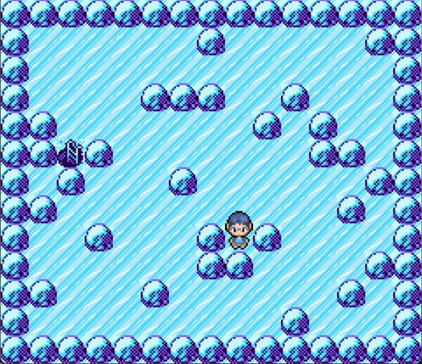

<h1 align="center">Ice Path Puzzle</h1>
<p align="center">
  
</p>

## :book: 目次

<details>
<summary>目次</summary>

* [このゲームについて](#video_game-このゲームについて)
* [概要](#memo-概要)
* [主要ファイルの説明](#file_folder-主要ファイルの説明)
* [使い方](#computer-使い方)
* [工夫した点](#art-工夫した点)
* [今後の展望](#triangular_flag_on_post-今後の展望)
* [クレジット](#scroll-クレジット)

</details>


## :video_game: このゲームについて

プレイヤーを動かして、目的地のはしごまで向かうミニゲームです。床が凍っているため、一度移動し始めると岩にぶつかるまで止まることができません。

## :memo: 概要

氷の床を滑りながら目的地に向かうパズルゲームの自動生成と、ビジュアライザを実装しました。氷の床パズルは有名でありながらミニゲームという立ち位置に留まっており、このパズルをメインとしたゲームがなかなか見つからなかったため、作成しました。

## :file_folder: 主要ファイルの説明

### パズルジェネレータ関連

* `main.cpp` - 氷の床パズルジェネレータの本体プログラム
* `res/map.txt` - 出力されたパズルのサンプル
* `res/answer.txt` - 出力されたパズルサンプルの答え
* `modlues/` - パズルジェネレータプログラムで使用するソースコード
* `nlohmann/json.hpp` - [nlohmann/json](https://github.com/nlohmann/json) からお借りした JSON ライブラリ
* `config/params.json` - 氷のパズルジェネレータのパラメータ設定ファイル、以下は設定項目の説明
  * `batch_count` - 生成回数
  * `size` - パズルのサイズ
  * `start` - スタート位置、`-1` でランダム化
  * `goal` - ゴール位置、`-1` でランダム化
  * `output_dirpath` - 出力先のディレクトリの相対パス
  * `map_filename` - 出力するパズルのテキストファイル名
  * `answer_filename` - 出力するパズルの答えのテキストファイル名

### ビジュアライザ関連

* `visualizer/visualizer.py` - ビジュアライザの本体プログラム
* `visualizer/modules/` - ビジュアライザで使用するソースコーd
* `visualizer/assets/` - ビジュアライザで使用する画像
* `visualizer/config/config.json` - ビジュアライザの設定ファイル、以下は設定項目の説明
  * `fps` - フレームレート
  * `font` - 答えの表示に使用する文字のフォント
  * `font_size` - 答えの表示に使用する文字の大きさ
  * `speed_offset` - プレイヤーの移動速度の補正値、`1.0` でデフォルトの1.0倍の速度
  * `map_filepath` - 出力されたパズルのテキストファイルパス
  * `answer_filepath` - 出力されたパズルの答えのテキストファイルパス


## :computer: 使い方

以下のURLから遊ぶこともできます。<https://replit.com/@takano536/ice-maze>

### パズルジェネレータ

C++コンパイラと CMake をインストールし、ビルドを行ってください。Windows 環境で以下のコンパイラと CMake による動作を確認しています。

```[powershell]
> g++ --version                                                                                                                                    
g++.exe (x86_64-posix-seh-rev2, Built by MinGW-W64 project) 12.2.0
Copyright (C) 2022 Free Software Foundation, Inc.
This is free software; see the source for copying conditions.  There is NO
warranty; not even for MERCHANTABILITY or FITNESS FOR A PARTICULAR PURPOSE.

> cmake --version                                                                                                                                  
cmake version 3.27.0

CMake suite maintained and supported by Kitware (kitware.com/cmake).
```

以下はビルドコマンドの一例です。

```[powershell]
> mkdir build && cd build
> cmake -DCMAKE_CXX_COMPILER:FILEPATH="${COMPILER_PATH}" -S"${PROJECT_HOME}" -B"${PROJECT_HOME}/build" -G "MinGW Makefiles"
> cmake --build "${PROJECT_HOME}/build" --target all -j 10 --
```

ビルドにより生成された実行ファイルを実行すると、`config/params.json`で設定したディレクトリにパズルとその答えが書かれたテキストファイルが生成されます。

### ビジュアライザ

Python をインストールし、requirements.txt を使用してパッケージをインストールしてください。python 3.10.11 で動作確認済みです。  

`visualizer/config/config.json`で設定したパスに、パズルジェネレータで生成されたテキストファイルが存在することを確認し、`visualizer/visualizer.py`を実行してください。  

以下は、ビジュアライザを起動するコマンドの一例です。

```[powershell]
> python ${PROJECT_HOME}/visualizer/visualizer.py
```

* AWSDキー または 矢印キー｜移動
* Rキー｜リスタート
* Spaceキー｜答えを表示
* Escapeキー｜終了


## :art: 工夫した点

### 探索アルゴリズム

幅優先探索を改良し、氷の床でも効率よく探索できるように実装を行いました。ゴール不可能なパズルは生成されません。

### 難しいパズルを生成するための検討

できるだけ難しいパズルが生成されるように、難易度の指標となるレーティングの算出方法の検討に時間を使いました。定性評価による検討により、難しいパズルについての考察を行いました。

* 一回の移動あたりの移動距離が長くなると、頭の中でシミュレーションを行うことが困難になり、難易度が上がる。
* ゴールまでの最短移動回数が多いほど、頭の中でシミュレーションを行うことが困難になり、難易度が上がる。

以上のことから、難しいパズルには以下の要素を含む必要があると考えました。

* ゴールまでの最短移動回数が多い。
* プレイヤーの止まる位置が多い。
* 石の数が多すぎない。石が多いと一回の移動あたりの移動距離が短くなるため。
* ゴールまでの最短移動回数が多いことが最重要事項。ゴールまでの最短移動回数が少ないと、たとえ他の2つの要素が達成されていたとしてもすぐにゴールに到達してしまい他の要素が意味を成さない。

最終的に、以下のレーティング算出方法を採用しました。

$ゴールまでの最短移動回数+\sqrt{プレイヤーの止まる位置の数}-\dfrac{外壁以外の石の数}{2}$

「プレイヤーの止まる位置の数」に平方根をとることで、「ゴールまでの最短移動回数」をより重視したレーティング算出を行うようになります。

### Pygame を使ったスムーズなアニメーション

Python はコンパイラ言語と比べて処理速度が遅いです。毎フレームでウインドウ全体を更新すると十分なフレームレートを維持することができません。プレイヤーの動いた範囲のみ更新することで、高いフレームレートを実現しています。

## :triangular_flag_on_post: 今後の展望

* 探索プログラムのメモリ使用量の削減。より素早い生成により、生成効率を上げる。
* レーティング算出方法の検討。難しいパズルに必要な要素の再検討。


## :scroll: クレジット

* C++用 JSON ライブラリ - nlohmann - <https://github.com/nlohmann/json>
* 岩や床、ゴールのはしごのタイルセット - Piacarrot - <https://www.deviantart.com/piacarrot/art/Ice-Path-Tileset-392684771>
* プレイヤーのスプライト - KleinStudio - <https://www.deviantart.com/kleinstudio/art/Young-Boy-OW-BW-Style-335151519>
* README.md の装飾 - andreasbm - <https://github.com/andreasbm/readme>
